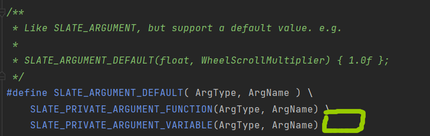

declarative syntax support声明的语法支持


```c++
//一个前向声明
template<typename WidgetType> struct TSlateBaseNamedArgs;//slate的基础具名参数
```


Slate widgets被构造，通过SNew和SAssignNew。

例如：

```c++
TSharedRef<SButton> MyButton = SNew(SButton);
或者
TSharedPtr<SButton> MyButton;
SAssignNew(MyButton, SButton);

使用SNew和SAssignNew保证widgets被填充
```


一个奇妙的宏：

```c++
#define SNew(WidgetType, ...)\
	MakeTDecl<WidgetType>(#WidgetType, __FILE__, __LINE__, RequiredArgs::MakeRequiredArgs(__VA_ARGS__)) <<= TYPENAME_OUTSIDE_TEMPLATE WidgetType::FArguments()
	
调用一个函数，首先是WidgetType的字符串，然后是文件，行，一个函数。
    
#define SAssignNew( ExposeAs, WidgetType, ... ) \
	MakeTDecl<WidgetType>( #WidgetType, __FILE__, __LINE__, RequiredArgs::MakeRequiredArgs(__VA_ARGS__) ) . Expose( ExposeAs ) <<= TYPENAME_OUTSIDE_TEMPLATE WidgetType::FArguments()
    
//这个也一样，但是多了一个ExposeAs，然后后面是.Expose(ExposeAs)
```


```c++
/*
Widget作者可以使用SLATE_BEGIN_ARGS还有SLATE_END_ARGS去添加支持
对于widget构造函数，通过SNew还有SAssignNew
例如：
SLATE_BEGIN_ARGS(SMyWidget)
	,_PreferredWidth(150.0f)
	,_ForegroundColor(FLinearColor::White)
	{}
	SLATE_ATTRIBUTE(float, PreferredWidth)
	SLATE_ATTRIBUTE(FSlateColor, ForegroundColor)
SALTE_END_ARGS()
*/

#define SLATE_BEGIN_ARGS(WidgetType) \
	public: \
	struct FArguments : public TSlateBaseNamedArgs<WidgetType>\
	{\
		typedef FAgrguments WidgetArgsType;\
		FORCENOINLICE FArguments()

//FArguments从TSlateBaseNamedArgs<WidgetType>继承，同时给类名一个别名WidgetArgsType

/*
就像SLATE_BEGIN_ARGS，但是要求用户去实现New()方法在.cpp里面
允许widget实现细节完全地驻留在.cpp文件中
例如：
	SMyWidget.h:
	------
	SLATE_USER_ARGS(SMyWidget)
	{}
	SLATE_END_ARGS()
	
	virtual void DoStuff() = nullptr;
	
	SMyWidget.cpp
	------
	namespace Implementation{
		class SMyWidget : public SMyWidget{
			void Construct(const FArguments& InArgs)
			{
				SUserWidget::Construct(SUserWidget::FArguments()
				[
					SNew(STextBlock).Text("Implementation Details!");
				]);
			}
			
			virtual void DoStuff() override{}
			
			//真正地私有，所有的处理可以被内联(少量的模板)
			//所有的私有成员是真正地私有
			private:
			FReply OnButtonClicked
			{
			
			}
			TSharedPtr<SButton> MyButton;
		}
	
	}
*/
#define SLATE_USER_ARGS(WidgetType)\
	public:\
	static TSharedRef<WidgetType> New();\
	struct FArguments;\
	struct FArguments : public TSlateBaseNamedArgs<WidgetType>\
	{\
		typedef FArguments WidgetArgsType;\
		FORCEINLIE FArguments()

#define SLATE_END_ARGS()\
};
```


```c++
#define SLATE_PRIVATE_ATTRIBUTE_VARIABLE(AttrType, AttrName)\
	TAttribute<AttrType> _##Attrame

#define SLATE_PRIVATE_ATTRIBUTE_FUNCTION(AttrType, AttrName)\
	WidgetArgsType& AttrName(const TAttribute<AttrType>& InAttribute)\
	{\
		_##AttrName = InAttribute;\
		return this->Me();\
	}\
\
template<typename StaticFuncPtr>\
WidgetArgsType& AttrName##_Static(StaticFuncPtr InFunc)
{\
  	_##AttrName = TAttribute< AttrType >::Create( TAttribute< AttrType >::FGetter::CreateStatic( InFunc ) ); \
    return this->Me();\
}\
```


SLATE_PRIVATE_ATTRIBUTE_VARIABLE定义了一个委托类型为AttrType，委托名为AttrName的。


```c++
#define SLATE_ATTRIBUTE(AttrType, AttrName)\
		SLATE_PRIVATE_ATTRIBUTE_VARIABLE(AttrType, AttrName);\
		SLATE_PRIVATE_ATTRIBUTE_FUNCTION(AttrType, AttrName)
```


SLATE_PRIVATE_ATTRIBUTE_FUNCTION宏创建了一堆函数，用来创建委托的。


CreateUObject接受一个对象，对象的函数，参数，去创建一个委托到成员_##AttrName上。


注意，这个Var1，Var2，Var3，Var4，固定输入的，传到InFunc里面，**然后返回AttrType这个值。**


下面那个SLATE_ARGUMENT，只能绑定值，不能绑定委托的。




这个类似于SLATE_ARGUMENT，但是后面，可以添加{1.0f}，即默认值。


SLATE_STYLE_ARGUMENT，有一些构造函数，接受来自于USlateWidgetStyleAsset的值。


使用这个宏在SLATE_BEGIN_ARGS还有SLATE_END_ARGS之间，**目的是去添加支持，对于slots。**


SLATE_SUPPORTS_SLOT声明一个**确定槽类型的**数组，还有一个+操作运算符，添加槽，可以携带参数。


某个槽类型，它的[]运算符，则具体地调用了AttachWidget，FSlotBase具体地引用了一个SWidget。


FSlateBaseNamedArgs这个基类，有很多基础的参数。


SImage的例子，可以看到，它在内部定义了一个FArguments结构体，从TSlateBaseNamedArgs<SImage>继承。然后定义了一个属性，以及它相关的东西。


赋值给_Image。


总结：SImage等SWidget内部用宏声明了一些参数，用来创建FArguments这个类。

**然后创建SImage的实例的时候，就可以使用链式编程，进行创建。**


因为像这种FArguments内的函数，都返回return *this，从而进行链式编程。


