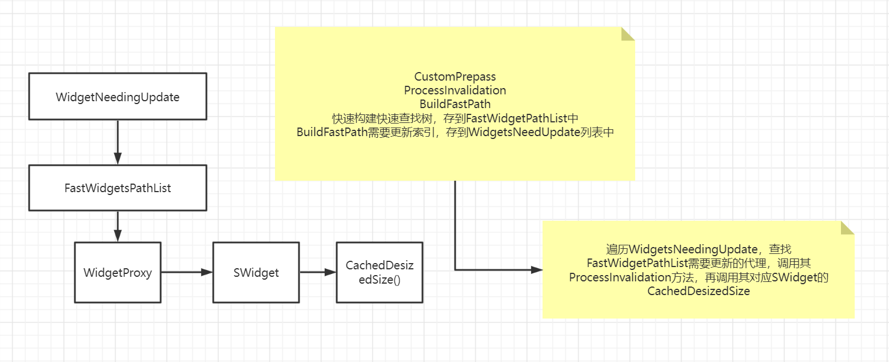

绘制预处理过程。


注释指出，这个DrawPrepass函数，这是一个Pre-pass阶段，在绘制窗口到计算几何大小以及reshape自动缩放的窗口的时候。


```c++
void FSlateApplication::DrawPrepass(TSharedPtr<SWindow> DrawOnlyThisWindow)
//FSlateApplication::PrivateDrawWindows去调用这个函数，传入一个nullptr
{
	TSharedPtr<SWindow> ActiveModalWindow = GetActiveModalWindow();//nullptr
    if(ActiveModalWindow.IsValid()){...}//针对模态窗口
    else if(DrawOnlyThisWindow.IsValid()){...}//只针对传入的参数的窗口
    else
    {
        //绘制所有窗口
        for(const TSharedRef<SWindow>& CurrentWindow : SlateWindows)
        {
            PrepassWindowAndChildren(CurrentWindow);//调用PrepassWindowAndChildren
        }
    }
}
```


DrawPrepass针对不同类型的窗口进行不同的处理。


SlateWindows是被这个应用所持有的**所有顶层窗口**，它们在这里被追踪在一个**平台无关**的方式。


之后DrawPrepass针对每个顶层窗口，调用一个静态函数，PrepassWindowAndChildren，传入顶层窗口。


```c++
static void PrepassWindowAndChildren(TSharedRef<SWindow> WindowToPrepass)
{
	//参数：需要预处理的Window
	
    //如果是运行在DS服务器上的，直接退出
    if(IsRunningDedicatedServer())
    {
        return;
    }
    
    //窗口可见的条件，可见外加不是最小化的
    const bool bIsWindowVisible = WindowToPrepass->IsVisible() && !WindowToPrepass->IsWindowMinimized();
    
    //如果窗口是可见的，或者该窗口的任何子代窗口都需要预处理的话
    //DoAnyWindowDescendantsNeedPrepass针对这个窗口的子代，判断它们是否为可见的，并且不是最小化的，是一个递归的过程
    //其实，这里有一些些小小的疑问，竟然父窗口看不见的话，为啥子代要进行判断呢？
    if(bIsWindowVisible || DoAnyWindowDescendantsNeedPrepass(WindowToPrepass))
    {
        WindowToPrepass->ProcessWindowInvalidation();//处理窗口的无效
        WindowToPrepass->SlatePrepass(FSlateApplication::Get().GetApplicationScale() *
        WindowToPrepass->GetNativeWindow()->GetDPIScaleFactor());//slate prepass，参数这里传入了一个布局缩放系数，还有一个DPI缩放因子
        
        if(bIsWindowVisible && WindowToPrepass->IsAutoSized())
        {
            //调用Resize函数
            WindowToPrepass->Resize(WindowToPrepass->GetDesizedSizeDesktopPixels());
        }
        
        //获取该窗口的儿子窗口
        TArray<TSharedRef<SWindow>, TMemStackAllocator<>> ChildWindows(WindowToPrepass->GetChildWindows());
        for(const TSharedRef<SWindow>& ChildWindow : ChildWindows)
        {
            PrepassWindowAndChildren(ChildWindow);//递归调用
        }
    }
}
```


PrepassWindowAndChildren是一个递归的过程，首先调用一些预处理函数，对当前这个父窗口进行计算，

然后再便利每个子窗口，**调用每个子窗口的PrepassWindowAndChildren。**


# ProcessWindowInvalidation

```c++
void SWindow::ProcessWindowInvalidation()//处理窗口无效
{
	//本身允许快速更新并且全局的无效化开启了
	if(bAllowFastUpdate && GSlateEnableGlobalInvalidation)
	{
		ProcessInvalidation();
	}
}
```


```c++
//SWindow是继承自FSlateInvalidationRoot和SCompoundWidget的
bool FSlateInvalidationRoot::ProcessInvalidation()
{
	//Widgets是否需要重新绘制
	bool bWidgetsNeedRepaint = false;
    
    if(!bNeedsSlowPath){...}
    
    if(!bNeedsSlowPath){...}
    
    if(!bNeedsSlowPath){...}
    
    //重新运行任何ChildOrder无效化，属性可能已经添加了新的ChildOrder
    if(!bNeedsSlowPath && WidgetsNeedingPreUpdate->Num() > 0){...}
    
    if(!bNeedsSlowPath){...}
    
    if(!bNeedsSlowPath){...}
    
    if(bNeessSlowPath){...}
    
 	return bWidgetsNeedRepaint   
}
```


有6个针对bNeedsSlowPath的处理块。


以下每一个都是针对不同语句块的内容：

```c++
ProcessPreUpdate();//处理预更新

ProcessAttributeUpdate();//处理属性更新

ProcessPreUpdate();//处理预更新，这里调用了两次，不太明白

//放置所有的widgets在VolatileUpdate list在WidgetsNeedingPostUpdate
//需要后处理更新的widgets
WidgetsNeedingPrepassUpdate->Heapify();//堆化?
WidgetsNeedingPostUpdate->Heapify();//堆化?
//堆化是否指的是类似二叉堆那样的东西，把一个数组变成堆?
//这里for循环，创建widget volatile 更新迭代器
//是FSlateInvalidationWidgetList的迭代器
for(FSlateInvalidationWidgetList::FWidgetVolatileUpdateIterator Iterator = 
FastWidgetPathList->CreateWidgetVolatileUpdateIterator(true); Iterator.IsValid(); Iterator.Advance())
{
	FSlateInvalidationWidgetList::InvalidationWidgetType& InvalidationWidget = 
	(*FastWidgetPathList)[Iterator.GetCurrentIndex()];//获取无效的widget，从FastWidgetPathList里获取
	
	//是否VolatilePrepass
	if(InvalidationWidget.bIsVolatilePrepass)
	{
		//无效理由
		InvalidationWidget.CurrentInvalidationReason |= EInvalidationWidgetReason::Layout;
		WidgetsNeedingPrepassUpdate->HeapPushUnique(InvalidationWidget);//WidgetsNeedingPrepassUpdate放入InvalidationWidget
	}
}

ProcessPrepassUpdate();//注意这个和前面的区别，多了一个prepass

FinalUpdateList.Reset(WidgetsNeedingPostUpdate->Num());
bWidgetsNeedRepaint = ProcessPostUpdate();

//这个针对bNeedsSlowPath
WidgetsNeedingPreUpdate->Reset(true);
WidgetsNeedingPrepassUpdate->Reset(true);
WidgetsNeedingPostUpdate->Reset(true);
FinalUpdateList.Reset();
CachedElementData->Empty();
bWidgetsNeedRepaint = true;
```


PreUpdate、PrepassUpdate、PostUpdate，3个过程。


如下是一个简略的过程：




# ProcessPreUpdate

FSlateInvalidationRoot，持有一个FSlateInvalidationWidgetList的独占指针，它表示所有widget的列表，被SlateInvalidationRoot所包含。

```c++
TSharedRef<SWidget> RootWidget = GetRootWidget();//这个虽然是FSlateInvalidationRoot的虚函数，但是由SWidget继承，并且返回自己本身

//所有widget的列表被这个SlateInvalidationRoot所包含
//这里首先，调用了FSlateInvalidationWidgetList的GetRoot函数，获取构建的widget列表的根，GetRoot返回的类型是弱指针，然后进行了提升，和本身进行比较，是否一致，如果不一致，就重新构建快速查找树
if(FastWidgetPathList->GetRoot().Pin() != RootWidget)
{
	BuildFastPathWidgetList(RootWidget);//build fast path widget list
    
    //add the root to the update list(to prepass and paint it)
    //添加根到update list(去预处理还有绘制它)
    WidgetsNeedingPostUpdate->Reset(true);//我们可以清理post list，因为所有的widgets将会被更新
    RootWidget->Invalidate(EInvalidateWidgetReason::Prepass);
}
else
{
    //这里定义了一个FChildOriderInvalidationCallbackImpl
    //fast widget path list
    //widgets needing pre update
    //widgets needing prepass update
    //widgets needing post update
    FChildOriderInvalidationCallbackImpl ChildOrderInvalidationCallback{ *FastWidgetPathList, *WidgetsNeedingPreUpdate, *WidgetsNeedingPrepassUpdate, *WidgetsNeedingPostUpdate };
    
    //widgets needing pre update的数量大于0，并且不需要slow path
    //如果是slow path，应该是全量更新
    while(WidgetsNeedingPreUpdate->Num() > 0 && !bNeedsSlowPath)
    {
        //process child order && attribute registration invalidation
        //处理儿子顺序，还有属性注册的无效化
        //堆顶弹出一个
        const FSlateInvalidationWidgetIndex WidgetIndex = WidgetsNeedingPreUpdate->HeapPop();
        SWidget* WidgetPtr = nullptr;
        EInvalidateWidgetReason CurrentInvalidateReason = EInvalidateWidgetReason::None;
        {
            //在一个ChildOrder之后，索引可能还没有改变，但是内部的数组已经增长了
            //增长可能无效化数组的地址
            const FSlateInvalidationWidgetList::InvalidationWidgetType& InvalidationWidget = (*FastWidgetPathList)[WidgetIndex];
            WidgetPtr = InvalidationWidget.GetWidget();
            CurrentInvalidateReason = InvalidationWidget.CurrentInvalidateReason;
        }
        
        //它可能已经被销毁了
        if(WidgetPtr)
        {
            bool bIsInvalidationWidgetValid = true;
            //有child order无效化理由
            if(EnumHasAnyFlags(CurrentInvalidateReason, EInvalidateWidgetReason::ChildOrder))
            {
                //process child order invalidation
                //处理儿子顺序无效化
                bIsInValidationWidgetValid = FastWidgetPathList->ProcessChildOrderInvalidation(WidgetIndex, ChildOrderInvalidationCallback);
                if(bIsInvalidationWidgetValid)
                {
                    FSlateInvalidationWidgetList::InvalidationWidgetType& InvalidationWidget = (*FastWidgetPathList)[WidgetIndex];
                    //处理完毕后，去除这个标识符
                    EnumRemoveFlags(InvalidationWidget.CurrentInvalidateReason, EInvalidateWidgetReason::ChildOrder);
                }
                
                //处理属性注册相关的
                if(bIsInvalidationWidgetValid && EnumHasAnyFlags(CurrentInvalidateReason, EInvalidateWidgetReason::AttributeRegistration))
                {
                    FSlateInvalidationWidgetList::InvalidationWidgetType& InvalidationWidget = (*FastWidgetPathList)[WidgetIndex];
                    FastWidgetPathList->ProcessAttributeRegistrationInvalidation(InvalidationWidget);
                    EnumRemoveFlags(InvalidationWidget.CurrentInvalidateReason, EInvalidateWidgetReason::AttributeRegistration);
                }
            }
        }
    }
}
```


其实，这里做了两个判断，如果根都不一样，直接全部处理掉，否则有针对性地处理。

WidgetsNeedingPreUpdate弹出的是widget的索引，然后处理相应的(*FastWidgetPathList)[WidgetIndex]的widget。


# ProcessAttributeUpdate

处理属性更新


```c++
FSlateInvalidationWidgetList::FWidgetAttributeIterator AttributeItt = FastWidgetPathList->CreateWidgetAttributeIterator();//获取属性迭代器

while(AttributeItt.IsValid())
{
    FSlateInvalidationWidgetList::InvalidationWidgetType& InvalidationWidget = (*FastWidgetPathList)[AttributeItt.GetCurrentIndex()];
    
    //获取widget
    SWidget* WidgetPtr = InvalidationWidget.GetWidget();
    
    if(ensureAlways(WidgetPtr))
    {
        //如果不是直接的折叠
        if(!InvalidationWidget.Visibility.IsCollapseIndirectly())
        {
            //如果我的父亲不是折叠的，那么更新我的可见状态
            FSlateAttributeMetaData::UpdateOnlyVisibilityAttributes(*WidgetPtr, FSlateAttributeMetaData::EInvalidationPermission::AllowInvalidation);
            
            //不是折叠的
            if(!InvalidationWidget.Visibility.IsCollapsed())
            {
                FSlateAttributeMetaData::UpdateExceptVisibilityAttributes(*WidgetPtr, FSlateAttributeMetaData::EInvalidationPermission::AllowInvalidation);
                AttributeItt.Advance();
            }
            else
            {
                AttributeItt.AdvanceToNextSibling();
            }
        }
        else
        {
            AttributeItt.Advance();
        }
    }
}
```


# ProcessPrepassUpdate

```c++
FSlateInvalidationWidgetList::FIndexRange PreviousInvalidationWidgetRange;

//previous invalidation widget range?

//it update forward(smallest index to biggest)
while(WidgetsNeedingPrepassUpdate->Num())
{
    //取出元素
    const FSlateInvalidationWidgetPrepassHeap::FElement WidgetElement = WidgetsNeedingPrepassUpdate->HeapPop();
    
    if(PreviousInvalidationWidgetReason.IsValid())
    {
        //它已经被处理了，通过之前的slate prepass
        if(PreviousInvalidationWidgetRange.Include(WidgetElement.GetWidgetSortOrder()))
        {
            continue;
        }
        FWidgetProxy& WidgetProxy = (*FastWidgetPathList)[WidgetElement.GetWidgetIndex()];
        PreviousInvalidationWidgetReason = FSlateInvalidationWidgetList::FIndexRange(*FastWidgetPathList, WidgetProxy.Index, WidgetProxy.LeafMostChildIndex);
        
        //widget可以为null，如果它已经被移除，并且我们在slow path
        if(SWidget* WidgetPtr = WidgetProxy.GetWidget())
        {
            //如果widget代理的可见性不是折叠的，并且是vola的prepass
            if(!WidgetProxy.Visiblity.IsCollapsed() && WidgetProxy.bIsVolatilePrepass)
            {
                WidgetPtr->MarkPrepassAsDirty();
            }
            //运行invalidation，它将运行在process post update
            //如果这里没有新的invalidation，那么widget的current invalidation应当为none，并且没有任何东西将执行
            //那么，如果需要的话，ProcessPostUpdate将添加widget到FinalUpdateList在更新正确的顺序
            WidgetProxy.ProcessPostInvalidation(*WidgetsNeedingPostUpdate, *FastWidgetPathList, *this);
            EnumRemoveFlags(WidgetProxy.CurrentInvalidateReason, Slate::PostInvalidationReason);
        }
    }
}
```


# ProcessPostUpdate

```c++
bool bWidgetNeedRepaint = false;

//it update backward(biggest index to smallest)
while(WidgetsNeedingPostUpdate->Num() && !bNeesSlowPath)
{
    const FSlateInvalidationWidgetPostHeap::FElement WidgetElement = WidgetsNeedingPostUpdate->HeapPop();
    FWidgetProxy& WidgetProxy = (*FastWidgetPathList)[WidgetElement.GetWidgetIndex()];
    
    //widget可以为null，如果它被移除，并且我们在slow path
    if(SWidget* WidgetPtr = WidgetProxy.GetWidget())
    {
        bWidgetsNeedRepaint |= WidgetProxy.ProcessPostInvalidation(*WidgetsNeedingPostUpdate, *FastWidgetPathList, *this);
        EnumRemoveFlags(WidgetProxy.CurrentInvalidateReason, Slate::PostInvalidationReason);
        
        if(WidgetPtr->HasAnyUpdateFlags(EWidgetUpdateFlags::AnyUpdate) && WidgetProxy.Visibility.IsVisible())
        {
            //压入FinalUpdateList
            //索引和顺序
            FinalUpdateList.Emplace(WidgetElement.GetWidgetIndex(), WidgetElement.GetWidgetSortOrder());
        }
    }
}

WidgetsNeedingPostUpdate->Reset(true);

return bWidgetsNeedRepaint
```


