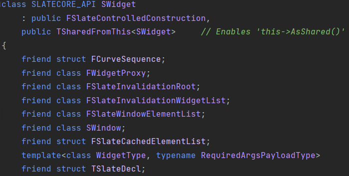

抽象基类，对于Slate widgets。


停止。不要直接地从WIDGET继承！


继承：

Widget不是意味着直接地被继承。相反考虑从LeafWidget或者Panel继承，表示预期的用例(?)并且提供**一组简洁的方法去重写。**


SWidget是对于所有交互的Slate实体的基类。SWidget的公共接口描述了所有事物，一个Widget可以做到的，因此相当复杂。


事件：

事件在Slate被实现作为虚函数，Slate系统将调用Widget，目的是去通知Widget关于一个重要事件(occurrence)(例如，一个按键)或者询问Widget，依据一些信息(例如，什么鼠标光标应当被显示)。


Widget提供一个默认实现，对于大多数事件；默认实现不做什么事情并且不处理事件。


一些事件能够回复系统通过返回一个FReply，FCursorReply，或者相似的对象。




SWidget继承FSlateControlledConstruction，TSharedFromThis<SWidget>，还有大量的友元。


2个Construct函数，从4.27开始，SWidget::Construct应当不被直接地调用。使用SNew或者SAssignNew去创建一个SWidget。


# 通用的事件

Paint，被调用去告诉一个widget去绘制它自己(还有它的儿子)。

widget应当响应，通过使用FDrawElements来填充OutDrawElements，来表示它还有任何它的儿子。


## Paint

```c++
int32 Paint(const FPaintArgs& Args, const FGeometry& AllottedGeometry, const FSlateRect& MyCullingRect, FSlateWindowElementList& OutDrawElements, int32 LayerId, const FWidgetStyle& InWidgetStyle, bool bParentEnabled) const;
```


Args，所有必要的参数去绘制这个widget(todo umg：移动所有的参数到这个结构体)。

AllottedGeometry，FGeometry描述了一个区域widget应当出现的。

MyCullingRect，分配的clipping rectangle(裁剪矩形)对于这个widget还有它的儿子。

OutDrawElements，一个列表的FDrawElements去填充输出。

LayerId，这个widget应当被渲染到的层。

InColorAndOpacity，颜色还有透明度去被应用到所有正在绘制的小部件的所有后代。

bParentEnabled，true，如果这个widget的父亲被开启。

**返回最大的layer ID被获取，通过这个widget或者任何它的儿子。**

## Tick

使用Geometry Tick这个widget。重写在派生类，但是总是调用父亲的实现。

AllocatedGeometry，分配的控件对于这个widget。

InCurrentTime，现在的绝对实时时间。

InDeltaTime，实时的时间，自从上一次Tick。

```c++
virtual void Tick(const FGeometry& AllottedGeometry, const double InCurrentTime, const float InDeltaTime);
```


## Key Input

被调用，当焦点被给予给这个widget。这个事件不会冒泡(bubble)？

MyGeometry，widget接受事件的几何。

InFocusEvent，FocusEvent。

返回，**是否事件被处理**，伴随着其它可能的行为。


```c++
virtual FReply OnFocusReceived(const FGeometry& MyGeometry, const FFocusEvent& InFocusEvent);
```


---


被调用，当这个widget丢失焦点。这个事件没有冒泡(bubble)？

InFocusEvent，FocusEvent。

```c++
virtual void OnFocusLost(const FFocusEvent& InFocusEvent);
```


---


每当在新旧焦点路径中的所有小部件上焦点路径发生变化时调用。

```c++
	UE_DEPRECATED(4.13, "Please use the newer version of OnFocusChanging that takes a FocusEvent")
	virtual void OnFocusChanging(const FWeakWidgetPath& PreviousFocusPath, const FWidgetPath& NewWidgetPath);
```

使用新版本的OnFocusChaing，获取一个FocusEvent。

---


```c++
virtual void OnFocusChanging(const FWeakWidgetPath& PreviousFocusPath, const FWidgetPath& NewWidgetPath, const FFocusEvent& InFocusEvent);
```

新版本，多了一个FFocusEvent。

---


被调用，在一个字符进入，当这个widget有键盘焦点。

MyGeometry，接受事件的widget的几何。

InCharacterEvent，字符事件。

返回是否事件被处理，伴随着其它可能的行为。

```c++
virtual FReply OnKeyChar(const FGeometry& MyGeometry, const FCharacterEvent& InCharacterEvent);
```

---


被调用，在一个键被按下，当这个widget或者这个widget的一个儿子有焦点的时候，

如果一个widget处理了这个事件，OnKeyDown将不会传递到焦点的widget。

这个事件主要是为了去允许父widgets去消耗一个事件在一个子widget处理它，并且它应当被使用，当这里没有更好的可选的事件。

MyGeometry，接受事件的widget的几何。

InKeyEvent，Key Event。

返回是否事件被处理，伴随着其它可能的行为。

```c++
virtual FReply OnPreviewKeyDown(const FGeometry& MyGeometry, const FKeyEvent& InKeyEvent);
```

---


被调用，在一个key被传递，当这个widget有焦点的时候(这个事件冒泡，如果没有被处理)。

MyGeometry，接受事件的widget的几何。

InKeyEvent，Key Event。

返回是否事件被处理，伴随着其它可能的行为。

```c++
virtual FReply OnKeyDown(const FGeometry& MyGeometry, const FKeyEvent& InKeyEvent);
```

---


被调用，在一个键被释放的时候，当这个widget有焦点的时候。

MyGeometry，接受事件的widget的几何。

InKeyEvent，Key Event。

返回是否事件被处理，伴随着其它可能的行为。

```c++
virtual FReply OnKeyUp(const FGeometry& MyGeometry, const FKeyEvent& InKeyEvent);
```


当支持**模拟(anaglog)**的按钮上的模拟值发生变化时调用。

MyGeometry，接受事件的widget的几何。

InKeyEvent，Key Event。

返回是否事件被处理，伴随着其它可能的行为。

```c++
virtual FReply OnAnalogValueChanged(const FGeometry& MyGeometry, const FAnalogInputEvent& InAnalogInputEvent);
```


大概有个AnalogValue，表示模拟值？**不大明确，FAnalogInputEvent。**


## Mouse Input

系统调用这个方法去通知widget，一个鼠标按钮被按下，在它立马。这个事件是冒泡的。

MyGeometry，接受事件的widget的几何。

MouseEvent，关于输入事件的信息。

返回是否事件与系统采取行动的可能请求一起被处理。

```c++
virtual FReply OnMouseButtonDown(const FGeometry& MyGeometry, const FPointerEvent& MouseEvent);
```

---


就像OnMouseButtonDown，但是tunnels代替冒泡。

如果这个事件被处理，OnMouseButtonDown将不会被发送。

谨慎使用这个此事件，因为预览事件通常会使得UI更难推理。

```c++
virtual FReply OnPreviewMouseButtonDown(const FGeometry& MyGeometry, const FPointerEvent& MouseEvent);
```

---


系统调用这个方法去通知widget，一个鼠标按钮被释放在它立马。这个事件是冒泡的。

MyGeometry，接受事件的widget的几何。

MouseEvent，关于输入事件的信息。

返回是否事件与系统采取行动的可能请求一起被处理。

```c++
virtual FReply OnMouseButtonUp(const FGeometry& MyGeometry, const FPointerEvent& MouseEvent);
```

---


系统调用这个方法去通知widget，一个鼠标移动到它这里。这个事件是冒泡的。

MyGeometry，接受事件的widget的几何。

MouseEvent，关于输入事件的信息。

返回是否事件与系统采取行动的可能请求一起被处理。

```c++
virtual FReply OnMouseMove(const FGeometry& MyGeometry, const FPointerEvent& MouseEvent);
```


系统将使用这个事件去通知一个widget，一个光标进入了它。事件是使用了一个自定义的冒泡策略。

MyGeometry，接受事件的widget的几何。

MouseEvent，关于输入事件的信息。

```c++
virtual void OnMouseEnter(const FGeometry& MyGeometry, const FPointerEvent& MouseEvent);
```


---

系统将使用这个事件去通知一个widget，光标已经离开了它。事件是使用了一个自定义冒泡策略。

MouseEvent，关于输入事件的信息。


```c++
virtual void OnMouseLeave(const FPointerEvent& MouseEvent);
```


---

被调用，当鼠标滚轮旋转的时候。这个事件已经冒泡。

MouseEvent，关于输入事件的信息。

返回是否事件被处理，跟随其它可能的行为。

```c++
virtual FReply OnMouseWheel(const FGeometry& MyGeometry, const FPointerEvent& MouseEvent);
```


---

系统要求鼠标下的每个小部件提供一个光标。这个事件是冒泡的。

FCusorReply::Unhandled()，如果事件没有被处理，否则返回FCusorReply::Cursor()。

```c++
virtual FCursorReply OnCursorQuery(const FGeometry& MyGeometry, const FPointerEvent& CursorEvent) const;
```


也就是鼠标下的widget要提供光标？


---

OnCursorQuery指定光标类型后，系统会要求鼠标下的每个小widget去映射该光标到小widget。

这个事件是冒泡的。

TOptional<TSharedRef<SWidget>>()，如果你没有一个映射，否则返回一个Widget去展示。

```c++
virtual TOptional<TSharedRef<SWidget>> OnMapCursor(const FCursorReply& CursorReply) const;
```

---

被调用，当一个鼠标按钮被双击的时候。**重写这个在派生类。**

InMyGeometry Widget几何。

MouseEvent，关于输入事件的信息。

返回是否事件被处理，跟随其它可能的行为。

```c++
virtual FReply OnMouseButtonDoubleClick(const FGeometry& InMyGeometry, const FPointerEvent& InMouseEvent);
```

---

被调用，当Slate想去可视化tooltip。

如果没有人处理这个事件，Slate将使用默认的tooltip可视化。

**如果你重写这个事件，你应当可能地返回true。**

TooltipContent 我可能想去可视化的TooltipContent。

返回true，如果这个widget可视化了tooltip内容，例如，事件被处理了。

```c++
virtual bool OnVisualizeTooltip(const TSharedPtr<SWidget>& TooltipContent);
```


---

可视化一个新的pop-up，如果可能的话。如果这个小部件不能承载弹出内容，你将返回一个指向该层的无效指针。

返回的FPopupLayer允许你去移除pop-up，当你已经完成了它。


PopupContent，要尝试并托管的小部件覆盖在小部件的顶部。

返回一个FPopupLayer，如果这个widget支持持有它。你可以调用Remove()在这个去消耗pop-up。

```c++
virtual TSharedPtr<FPopupLayer> OnVisualizePopup(const TSharedRef<SWidget>& PopupContent);
```

---

被调用，当Slate检测一个widget开始被拖(dragged)。

用法：

一个widget可以请求Slate去检测一个drag。

OnMouseDown()答复，使用FReply::Handled().DetectDrag(SharedThis(this))

Slate将么发送一个OnDragDetected()事件或者什么都不做。

如果用户释放了一个鼠标按钮或者离开widget在一个拖动(drag)被触发(可能用户开始在一个非常的边缘)，那么没有事件将被发送。


InMyGeometry，Widget几何。

InMouseEvent，触发drag的MouseMove。

```c++
virtual FReply OnDragDetected(const FGeometry& MyGeometry, const FPointerEvent& MouseEvent);
```

---

## Drag And Drop(DragDrop)


被调用，在drag和drop，当drop(落下)进入一个widget。


进入/离开 事件在slate意味着作为轻量的通知。

那么我们不想去捕获鼠标或者设置焦点作为对这些的响应。

然而，OnDragEnter必须也支持外部的APIs(例如，OLE Drag/Drop)

这些要求我们让它们知道是否我们可以处理内容，在被抓取OnDragEnter。


妥协是去返回一个can_handled/cannot_handle布尔值，而不是一个完整的FReply。


MyGeometry，接收事件的widget的几何。

DragDropEvent，drag和drop事件。

返回一个reply，表示是否DragDropEvent的内容可以潜在地被处理通过这个widget。

```c++
virtual void OnDragEnter(const FGeometry& MyGeometry, const FDragDropEvent& DragDropEvent);
```

---

被调用在drag和drop，当drag离开一个widget。

DragDropEvent，drag和drop事件。

```c++
virtual void OnDragLeave(const FDragDropEvent& DragDropEvent);
```


被调用在drag和drop的事件，当鼠标被抓取拖过一个widget。

MyGeometry，接受事件的widget的几何。

DragDropEvent，drag和drop事件。

返回一个回复，表示是否这个事件被处理。

```c++
virtual FReply OnDragOver(const FGeometry& MyGeometry, const FDragDropEvent& DragDropEvent);
```


---

被调用，当用户放下什么东西在一个widget，终止drag和drop。

MyGeometry，接受事件的widget的几何。

DragDropEvent，drag和drop事件。

返回一个回复，表示是否这个事件被处理。

```c++
virtual FReply OnDrop(const FGeometry& MyGeometry, const FDragDropEvent& DragDropEvent);
```


## TOUCH and GESTURES

触摸还有手势


被调用，当用户执行一个手势在一个trackpad(触控板)。这个事件是冒泡的。

GestureEvent，手势事件。

返回是否一个事件是否冒泡，伴随着可能的行为。

```c++
virtual FReply OnTouchGesture(const FGeometry& MyGeometry, const FPointerEvent& GestureEvent);
```

---

被调用，当一个touchpad(触摸板)开始的时候(手指向下)，就是可以用笔在屏幕上画画的。

InTouchEvent，触摸事件生成的。

```c++
virtual FReply OnTouchStarted(const FGeometry& MyGeometry, const FPointerEvent& InTouchEvent);
```

---

被调用当一个触摸板触摸被移开的时候(鼠标移开的时候)。

InTouchEvent，生成的触摸事件。

```c++
virtual FReply OnTouchMoved(const FGeometry& MyGeometry, const FPointerEvent& InTouchEvent);
```

---

被调用，当一个触摸板触摸被终止(手指抬起(lifted))。

InTouchEvent，生成的触摸事件。

```c++
virtual FReply OnTouchEnded(const FGeometry& MyGeometry, const FPointerEvent& InTouchEvent);
```

---

被调用，当一个触摸板强迫改变的时候。

InTouchEvent，生成的触摸事件。

```c++
virtual FReply OnTouchForceChanged(const FGeometry& MyGeometry, const FPointerEvent& TouchEvent);
```

---

被调用，当一个触摸板，在TouchStarted移动后。

InTouchEvent，生成的触摸事件。

```c++
virtual FReply OnTouchFirstMove(const FGeometry& MyGeometry, const FPointerEvent& TouchEvent);
```

---

被调用，当motion(动作)被检测的时候(控制器或设备)

例如，有人倾斜或者摇晃控制器。

InMotionEvent，生成的motion事件。

```c++
virtual FReply OnMotionDetected(const FGeometry& MyGeometry, const FMotionEvent& InMotionEvent);
```

---

被调用，检测是否我们应当渲染焦点画刷(focus brush)。

InFocusCause，焦点的结果。

```c++
virtual TOptional<bool> OnQueryShowFocus(const EFocusCause InFocusCause) const;
```

---

Popups可以显示在一个新的OS WINDOW或者通过一个OVERLAY在一个存在的window。

这个可以被显示地设置在SMenuAnchor，或者可以被决定，通过一个scoping widget。

一个scoping widget可以回复OnQueryPopupMethod()去驱动所有它的子代poup方法。


全屏的游戏不能够传唤一个新窗口，那么游戏SViewports将回复EPopupMethod::UserCurrentWindow。

这个使得所有在它们的menu anchors使用现在的窗口。

```c++
virtual FPopupMethodReply OnQueryPopupMethod() const;
```

---


一个不知道有什么用的函数

```C++
virtual TSharedPtr<FVirtualPointerPosition> TranslateMouseCoordinateForCustomHitTestChild(const TSharedRef<SWidget>& ChildWidget, const FGeometry& MyGeometry, const FVector2D& ScreenSpaceMouseCoordinate, const FVector2D& LastScreenSpaceMouseCoordinate) const;
```

转换鼠标坐标对于自定义的碰撞检测儿子。

---

所有的指针(鼠标，触摸，触笔(stylvs)，等)事件已经从该帧路由(routed)。

这是一个widget的机会**去执行任何累积的数据。**

```C++
virtual void OnFinishedPointerInput();
```

---

所有的键(键盘，gamepay，joystick，等等)输入从这帧已经被路由。

这是一个widget的机会**去执行任何累积的数据。**

```c++
virtual void OnFinishedKeyInput();
```

---

被调用，当鼠标移过widget的window，去决定是否我们应当报告是否OS确切的特性应当被激活在这个位置(例如一个title bar grip，系统菜单，等等)。

通常，你不需要去重载这个函数。

---

返回，光标所在的窗口区域，或者EWindowZone::Unspecified，如果没有特殊的行为被需要。

```c++
virtual EWindowZone::Type GetWindowZoneOverride() const;
```

---

accessibility n.可访问性

```c++
virtual TSharedRef<class FSlateAccessibleWidget> CreateAccessibleWidget();
```

---


## LAYOUT

布局


```c++
bool NeedsPrepass() const { return bNeedsPrepass; }
```


---

SlatePrepass的遗留版本，假设没有缩放超过AppScale。

```c++
void SlatePrepass();
```

---

下降到层次结构中的叶子最多(leaf-most)的widget，并且在向上的过程中收集所需要的大小。

例如，递归地cache所有widget的儿子所需要的大小，然后cache所需要的大小对于它自己。

```c++
void SlatePrepass(float InLayoutScaleMultipler);
```

参数，在布局缩放乘积？

---

```c++
void SetCanTick(bool bInCanTick){ bInCanTick ? AddUpdateFlags(EWidgetUpdateFlags::NeedsTick) : RemoveUpdateFlags(EWidgetUpdateFlags::NeedsTick);};//根据参数设置是否移除可以更新的枚举变量
```

---

```c++
bool GetCanTick() const { return HasAnyUpdateFlags(EWidgetUpdateFlags::NeedsTick); }//是否可以Tick
```

---

返回真，如果widgets有任何bound slate属性。

```c++
bool HasRegisteredSlateAttribute() const { return bHasRegisteredSlateAttribute; }//有注册的Slate属性
```

---

返回真，如果widgets将更新它注册的slate属性自动地，或者它们需要去被自动地更新。

```c++
bool IsAttributesUpdatesEnabled() const { return bEnabledAttributesUpdate; }
```

---

Persistent，持久的

获取持久的状态？

```c++
const FSlateWidgetPersistentState& GetPersistentState() const { return PersistentState; }
```

---

FWidgetProxyHandle，快速路径代理句柄？

```c++
const FWidgetProxyHandle GetProxyHandle() const { return FastPathProxyHandle; };//快速路径代理句柄
```

---

返回DersiredSize，它被计算自从上一次CacheDesiredSize()被调用后。

```c++
FVector2D GetDesiredSize() const;
```

这个函数比较重要？

---

```c++
void AssignParentWidget(TSharedPtr<SWidget> InParent);
```

赋值父亲Widget，这里是个共享指针，生命周期不知道是谁的。

---

```c++
bool ConditionallyDetachParentWidget(SWidget* InExpectedParent);
```

有条件地分离父Widget，参数是渴望的Parent？

---

无效化到Child的路径？

```c++
virtual bool ValidatePathToChild(SWidget* InChild) { return true; }
```

---

```c++
FORCEINLINE bool IsParentValid() const { return ParentWidgetPtr.IsValid(); }//parent widget是否有效
```

---

```c++
FORCEINLINE TSharedPtr<SWidget> GetParentWidget() const { return ParentWidgetPtr.Pin(); }
```

---

```c++
FORCEINLINE TSharedPtr<SWidget> Advanced_GetPaintParentWidget() const { return PersistentState.PaintParent.Pin(); }
```

这个函数不明，返回持久数据的PaintParent?

---

计算绘制这个小widget的时候，如果需要进行任何剪切状态的改变，会发生什么情况？

返回应该继续使用的裁剪矩形。

```c++
FSlateRect CalculateCullingAndClippingRules(const FGeometry& AllottedGeometry, const FSlateRect& MyCullingRect, bool& bClipToBounds, bool& bAlwaysClip, bool& bIntersectClipBounds) const;//计算剔除(Culling)和裁剪(Clipping)规则
```

---

```c++
bool HasAnyUpdateFlags(EWidgetUpdateFlags FlagsToCheck) const
{
	//有任何更新标识符
    //UpdateFlags是成员变量
	return EnumHasAnyFlags(UpdateFlags, FlagsToCheck);
}
```

---

```c++
void SetVolatilePrepass(bool bVolatile)//设置volatile prepass
{
	bVolatile ? AddUpdateFlags(EWidgetUpdateFlags::NeedsVolatilePrepass) : RemoveUpdateFlags(EWidgetUpdateFlags::NeedsVolatilePrepass);//这里移除了volatile prepass
}
```

---

系统调用这个方法，它执行了一个**宽度优先(breadth-first)的遍历**，对于每个可见的widget，并且要求每个widget去cache它所需要多大去表现所有它的内容。

这个方法比较重要。

```c++
virtual void CacheDesiredSize(float InLayoutScaleMultipiler);
```

---

计算理想的需要的大小去显示这个widget。对于聚合(aggregate) widgets(例如，panels)，这个大小应当包含需要的大小去显示所有它的儿子。

CacheDesiredSize()保证子级的大小被计算和cached在父亲的大小之前，**那么它是安全的去调用GetDesiredSze()对于任何儿子，当实现这个方法。**

注意ComputeDesiredSize()意味着一个助手对于开发者。它不是意味着robust在多数情况。如果你的widget是模拟一个弹跳球(bouncing ball)，

你应当只是返回一个合理的尺寸，例如，160 * 160，让程序员设置一个合理的规则去计算bouncy ball模拟。

LayoutScaleMultipiler，这个参数是安全的去忽略对于大多数widget，只影响文本的mesauring。

返回需要的大小。

```c++
virtual FVector2D ComputeDesiredSize(float LayoutScaleMultiplier) const = 0;
```

---

```c++
void SetFastPathProxyHandle(const FWidgetProxyHandle& Handle) { FastPathProxyHandle = Handle; }//设置快速路径代理Handle
```

```c++
void SetFastPathProxyHandle(const FWidgetProxyHandle& Handle, FSlateInvalidationWidgetVisibility Visibility, bool bParentVolatile);
```

```c++
void SetFastPathSortOrder(const FSlateInvalidationWidgetSortOrder SortOrder);//设置快速路径排序？
```

---

```c++
void UpdateFastPathVisibility(FSlateInvalidateWidgetVisibility ParentVisibility, FHittestGrid* ParentHittestGrid);//更新快速路径可见性？
```

```c++
void UpdateFastPathWidgetRemoved(FHittestGrid* ParentHittestGrid);//更新快速路径widget移除的？
```

```c++
void UpdateFastPathVolatility(bool bParentVolatile);//更新快速路径波动(Volatility)
```

这三个函数不大明确。

---

```c++
//显式地设置需要的大小。这是一个高度高级的功能，意味着与CacheDesiredSize综合使用。请使用ComputeDesiredSize()代替。
void SetDesiredSize(const FVector2D& InDesiredSize)
{
	DesiredSize = FVector2f(InDesiredSize);
}
```

---

```c++
void AddUpdateFlags(EWidgetUpdateFlags FlagsToAdd)//添加更新标识符
{
	EWidgetUpdateFlags Previous = UpdateFlags;//之前的更新标识符
	UpdateFlags |= FlagsToAdd;
	FastPathProxyHandle.UpdateWidgetFlags(this, Previous, UpdateFlags);//更新widget flags
}
```

快速路径代理不知道干吗的，暂时放置。

---

```c++
void RemoveUpdateFlags(EWidgetUpdateFlags FlagsToRemove)
{
	EWidgetUpdateFlags Previous = UpdateFlags;
	UpdateFlags &= (~FlagsToRemove);//移除
	FastPathProxyHandle.UpdateWidgetFlags(this, Previous, UpdateFlags);
}
```

---

```c++
void UpdateWidgetProxy(int32 NewLayerId, FSlateCachedElementsHandle& CacheHandle);
```

更新widget代理，参数新的LayerId，第二个参数是FSlateCachedElementsHandle。

---

```c++
UE_DEPRECATED(4.24, "GetRelativeLayoutScale(int32 ChildIndex, float LayoutScaleMultiplier), your widget will also need to set bHasRelativeLayoutScale in their Construct/ctor.")
//你的widget将也需要去设置bHasRelativeLayoutScale在它们的构造函数/ctor
virtual float GetRelativeLayoutScale(const FSlotBase& Child, float LayoutScaleMultiplier) const { return 1.0f; }
```

---

```c++
//儿子的scale相对于这个widget是多少
virtual float GetRelativeLayoutScale(const int32 ChildIndex, float LayoutScaleMultipler) const;
```

---

非虚拟入口点对于arrange children。保证通用的工作被执行，在调用虚拟ArrangeChildren函数。

计算所有的儿子的几何，并且填充ArrangedChildren列表，使用它们的值。

每个类型的layout panel应当安排儿子依据需要的行为。

AllottedGeometry，分配的几何对于这个widget通过它的父亲。

ArrangedChildren，数组去添加WidgetGeometries，表示arranged children。

```c++
void ArrangeChildren(const FGeometry& AllottedGeometry, FArrangedChildren& ArrangedChildren) const;
```

---

每个有儿子的widget必须实现这个方法。这个允许遍历Widget的儿子，依据它们实际如何存储的。

```c++
//todo Slate：考虑命名为GetVisibleChildren(不是所有的儿子将会被返回在所有的情况)
virtual FChildren* GetChildren() = 0;
```

---

```c++
virtual FChildren* GetAllChildren() { return GetChildren(); }
```

---

检测是否这个widget支持键盘焦点，重载这个在派生类。

返回真，如果这个widget可以输入键盘焦点。

```c++
virtual bool SupportsKeyboardFocus() const;
```

---

获取是否有确切的用户有这个聚焦的widget，并且如果是，焦点的类型。

返回，optional将被设置为聚焦的情况，如果unset这个widget，不会有焦点。

```C++
TOptional<EFocusCause> HasUserFocus(int32 UserIndex) const;
```

---

获取是否任何用户有这个聚焦的widget，并且如果是，焦点的类型(第一个被找到)。

返回，optional将被设置focus情况，如果unset这个widget，不会有焦点。

```c++
TOptional<EFocusCause> HasAnyUserFocus() const;
```

---

返回是否这个widget有任何带键盘焦点的子代。

```c++
bool HasFocusedDescendants() const;
```

---

返回是否任何用户有这个聚焦的widget，或者任何聚焦的子代。

```c++
bool HasAnyUserFocusOrFocusedDescendants() const;
```

---

检测是否这个widget是现在的鼠标捕获者。

返回，是否这个widget已经捕获了鼠标。

```c++
bool HasMouseCapture() const;
```

---

检测是否这个widget有鼠标捕获从提供的用户。

返回真，如果这个widget已经捕获了鼠标。

```c++
bool HasMouseCaptureByUser(int32 UserIndex, TOptional<in32> PointerIndex = TOptional<in32>()) const;
```

---

被调用当这个widget已经捕获了鼠标，但是那个捕获已经被移除了由于一些原因。

```c++
virtual void OnMouseCaptureLost(const FCaptureLostEvent& CaptureLostEvent);
```

---

设置这个widget的开启的状态。

参数，InEnabledState，一个属性包含开启的状态或者一个委托去调用，去获取开启的状态。

```c++
void SetEnabled(const TAttribute<bool>& InEnabledState)
{
	//TargetValue和SourceValue
	SetAttribute(EnabledState, InEnabledState, EInvalidateWidgetReason::Paint);
}
```


---

返回是否这个widget是开启的。

```c++
FORCEINLINE bool IsEnabled() const
{
	return EnabledState.Get();
}
```

---

返回是否这个widget可交互的？默认为false。

```c++
virtual bool IsInteractable() const
{
	return false;
}
```

---

tool tip被关联到这个widget，无效的引用，如果这里没有一个

```c++
virtual TSharedPtr<IToolTip> GetToolTip();
```

---

被关闭，当一个tooltip从这个widget被关闭，当关闭的时候。

```c++
virtual void OnToolTipClosing();
```

---

设置是否这个widget是一个tool tip force field。那是，tool-tips应当不应该出现在这个widget所占据的区域上，

并且将被排斥到外部边缘。

参数 bEnableForceField，真去开启tool tip force field对于这个widget。

```c++
void EnableToolTipForceField(const bool bEnableForceField);
```

---

返回真，如果一个tool tip force field是激活的，在这个widget。

```c++
bool HasToolTipForceField() const
{
	return bToolTiplForceFieldEnabled;
}
```

---

返回true，如果这个widget hovered。

```c++
virtual bool IsHovered() const
{
	return bIsHovered;
}
```

---

返回true，如果这个widget是直接地hovered。

```c++
virtual bool IsDirectlyHovered() const;
```

---

返回，这个widget是否可见，隐藏或者折叠。

这个widget可以是可见的，但是如果一个父亲是隐藏的或者折叠的，它将不会显示在屏幕上。

```c++
FORCEINLINE EVisibility GetVisibility() const { return Visibility.Get(); }
```

---

参数InVisibility，这个widget应当是什么。

```c++
virtual void SetVisibility(TAttribute<EVisibility> InVisibility);
```

---

返回widget是否可见的，并且它的父亲是否是可见的。

注意，只有有效的，如果widget被获取，通过一个InvalidationRoot(代理是有效的)。

```c++
bool IsFastPathVisible() const { return !bInvisibleDueToParentOrSelfVisibility; }
```

---

accessibility n.可访问性

获取文本，应当被报告给用户的，当企图去访问这个widget。

参数，AccessibleType，是否widget被直接地访问，或者通过一个总结访问。

返回，文本应当被传递给用户描述这个widget。

```c++
FText GetAccessibleText(EAccessibleType AccessibleType = EAccessibleType::Main);
```

---

遍历所有的儿子widgets还有链接它们的GetAccessibleText(Sumary)的结果。

返回所有儿子widegt的summary text的合并的文本。

```c++
FText GetAccessibleSummary() const;
```

---

是否这个widget被考虑为可访问或者不可以访问的。一个widget是可访问的，如果它的行为被设置为一些事物，而不是NotAccessible，

并且所有它的parent widgets支持可访问的儿子。

```c++
bool IsAccessible() const;
```

---

获取描述的行为，这个widget的可访问的widget应当如何被获取。

参数，AccessibleType，是否这个widget被直接地访问或者通过一个summary询问。

返回widget的可访问的行为。

```c++
EAccessibleBehavior GetAccessibleBehavior(EAccessibleType AccessibleType = EAccessibleType::Main) const;
```

---

设置一个新的可访问的行为，并且如果行为是自定义的，新的可访问的文本会去伴随着它。

参数InBehavior，widget的新的行为，如果新的行为是自定义的，InText应当也被设置。

参数InText，如果新的行为是自定义的，这个将是自定义的文本被赋予给widget。

AccessibleType，是否widget被直接地访问，或者通过一个summary query。

```c++
void SetAccessibleBehavior(EAccessibleBehavior InBehaviour, const TAttribute<FText>& InText = TAttribute<FText>(), EAccessibleType AccessibleType = EAccessibleType::Main)
```

---

设置是否儿子是否被允许可以访问。

警告：调用这个函数在可访问性之后被开启的，将造成可访问性树变得不同步。

参数InCanChildrenBeAccessible，是否儿子应当是可以访问的或者不行。

```c++
void SetCanChildrenBeAccessible(bool InCanChildrenBeAccessible);
```

---

赋值AccessibleText，使用一个默认值，可以被使用，当AccessibleBehaviour被设置为Auto或者Custom。

参数，AccessibleType，是否widget被直接地访问或者通过一个summary query。

```c++
virtual TOptional<FText> GetDefaultAccessibleText(EAccessibleType AccessibleType = EAccessibleType::Main) const;
```

---

是否一个widget是volatile并且每一帧更新，没有被无效化。

```c++
FORCEINLINE bool IsVolatile() const { return bCachedVolatile; }
```

---

这个widget是volatile，因为它的父亲或者一些祖先是volatile的，

注意，只有有效的，如果widget被获取通过一个InvalidationRoot(代理是有效的)。

```c++
FORCEINLINE bool IsVolatileIndirectly() const { return bInheritedVolatility; }
```

---

这个widget是否应当总是出现为volatile对于任何布局，caching host widget？

一个volatile的widget的几何还有layout data将永远不会被cached，并且孩子们也不会。

参数bForce，是否我们强制widget去变得volatile？

```c++
FORCEINLINE void ForceVolatile(bool bForce)
{
	if(bForceVolatile != bForce)
	{
		bForceVolatile = bForce;
		Invalidate(EInvalidateWidgetReason::PaintAndVolatility);
	}
}
```

---

```c++
FORCEINLINE bool ShouldInvalidatePrepassDueToVolatility() { bVolatilityAlwaysInvalidatesPrepass; }
```

---

无效化widget，从一个layout caching widget的视角看去，它持有这个widget。

将强迫持有的widget去重新绘制并且cache儿子在下一次绘制pass。

```c++
void Invalidate(EInvalidateWidgetReason InvalidateReason);
```

---

重新计算widget的volatility，并且cache结果。应当被调用，**在你的ComputeVolatility的实现被改变的时候进行检查。**

```c++
FORCEINLINE void CachedVolatility()
{
	bCachedVolatile = bForceVolatile || ComputeVolatility();
}
```

---

```c++
UE_DEPRECATED(5.0, "InvalidatePrepass is deprecated. Use the Invalidate(EInvalidateWidgetReason::Prepass) or use MarkPrepassAsDirty()")
void InvalidatePrepass();//这个函数被遗弃了
```

---

快速路径，如果widget被标记，做一次完整的prepass在它的下一次更新，去计算它的渴望的大小。

这个不会无效化widget。

```c++
void MarkPrepassAsDirty() { bNeesPrepass = true; }
```

---

测试是否一个arranged widget(排列的widget)应当被剔除
参数MyCullingRect，widget的裁剪矩形现在做culling
参数ArrangedChild，在widget上的arranged widget现在企图去剔除儿子

```c++
bool IsChildWidgetCulled(const FSlateRect& MyCullingRect, const FArrangedWidget& ArrangedChild) const;
```

---

被调用，当一个child被从树父亲的控件树中移除，方法是从插槽中删除它。这个可以被手动地调用，如果你已经获取了一些基于非slot的，不再报告给儿子的。一个手动调用的widget的例子是SWidgetSwitcher，它持有所有它的儿子，但是只安排和绘制一个单一的active一个。一旦一个儿子变得inactive，它的cached data应当被移除。

```c++
void InvalidateChildRemovedFromTree(SWidget& Child);
```

---

计算和cache volatility，并且返回真，如果volatility改变了。

```c++
FORCEINLINE bool Advanced_InvalidateVolatility()
{
	const bool bWasDirectlyVolatile = IsVolatile();
	CacheVolatility();
	return bWasDirectlyVolatile |= IsVolatile();
}
```

---

返回widget的渲染透明度

```c++
FORCELINE float GetRenderOpacity() const
{
	return RenderOpacity();
}
```

---

参数，InOpacity，widget的透明度，在渲染的时候。

```c++
FORCEINLINE void SetRenderOpacity(float InRenderOpacity)
{
	if(RenderOpacity != InRenderOpacity)
	{
		RenderOpacity = InRenderOpacity;
		Invalidate(EInvalidateWidgetReason::Paint);//这里无效化了一下
	}
}
```

---

```c++
FORCELINE void SetTag(FName InTag)
{
	Tag = InTag;
}
```

---

返回widget的render transform

```c++
FORCEINLINE const TOptional<FSlateRenderTransform>& GetRenderTransform() const
{
	return RenderTransformAttribute.Get();//返回RenderTransformAttribute
}
```

---

返回RenderTransform，依据流的方向。

```c++
FORCEINLINE TOptional<FSlateRenderTransform> GetRenderTransformWithRespectToFlowDirection() const
{
	if(LIKELY(GSlateFlowDirection == EFlowDirection::LeftToRight))//判断方向
	{
		return RenderTransformAttribute.Get();
	}
	else
	{
		//如果我们从右往左，翻转x位移在render transforms
		TOptional<FSlateRenderTransform> Transform = RenderTransformAttribute.Get();
		if(Transform.IsSet())
		{
			FVector2D Translation = Transform.GetValue().GetTranslation();
			Transform.GetValue().SetTranslation(FVector2D(-Translation.X, Translation.Y));
		}
		return Transform;
	}
}
```

---

```c++
FORCEINLINE FVector2D GetRenderTransformPivotWithRespectToFlowDirection() const//这个函数和上面那个对比，这个有镜像
{
	if(LIKELY(GSlateFlowDirection == EFlowDirection::LeftToRight))
	{
		return RenderTransformPivotAttribute.Get();
	}
	else
	{
		//如果从右到左，翻转x的pivot以0.5为镜像
		FVector2D TransformPivout = RenderTransformPivotAttribute.Get();
		TransformPivot.X = 0.5f + (0.5f - TransformPivot.X);
		return TransformPivot;
	}
}
```

---

参数InTransform，render transform去设置对于widget(从widget的局部空间变换)，TOptional<>允许代码去忽略昂贵的开销，如果这里没有render transform应用。

```c++
FORCEINLINE void SetRenderTransoform(TAttribute<TOptional<FSlateRenderTransform> InTransform)
{
	RenderTransformAttribute.Assign(*this, MoveTemp(InTransform));
}
```

---

返回render transform的pivot点

```c++
FORCEINLINE FVector2D GetRenderTransformPivot() const
{
	return RenderTransformPivotAttribute.Get();
}
```

---

参数InTransformPivot，设置widget的render transform的pivot点(在归一化的局部空间)

```c++
FORCEINLINE void SetRenderTransformPivot(TAttribute<FVector2D> InTransformPivot)
{
	RenderTransformPivotAttribute.Assign(*this, MoveTemp(InTransformPivot));
}
```

---

设置对于这个widget的裁剪到边界

```c++
FORCEINLINE void SetClipping(EWidgetClipping InClipping)
{
	if(Clipping != InClipping)
	{
		Clipping = InClipping;
		OnClippingChanged();
		//todo fast path should this be paint?
		Invalidate(EInvalidateWidgetReason::Layout)
	}
}
```

---

返回现在的clipping规则，对于这个widget。

```c++
FORCEINLINE EWidgetClipping GetClipping() const
{
	return Clipping;
}
```

---

设置一个额外的剔除padding，被添加到一个widget，去给定更多的余地(leeway)，当剔除widgets的时候。

有用的，如果一些子widgets有渲染，超出它们的边界的时候。

```c++
FORCEINLINE void SetCullingBoundsExtension(const FMargin& InCullingBoundsExtension)
{
	if (CullingBoundsExtension != InCullingBoundsExtension)
	{
		CullingBoundsExtension = InCullingBoundsExtension;
		// @todo - Fast path should this be Paint?
		Invalidate(EInvalidateWidgetReason::Layout);
	}
}
```

---

返回CullingBoundsExtension

```c++
FORCEINLINE FMargin GetCullingBoundsExtension() const
{
	return CullingBoundsExtension;
}
```

---

设置内容如何flow在这个panel，基于现在的培养物(culture)。默认，所有的panels从以上的widgets继承状态。如果它们设置了一个新的

flow方向，它将从树上继承下来。

```c++
void SetFlowDirectionPreference(EFlowDirectionPreference InFlowDirectionPreference)
{
	if(FlowDirectionPreference != InFlowDirectionPreference)
	{
		FlowDirectionPreference = InFlowDirectionPreference;
		Invalidate(EInvalidateWidgetReason::Paint);
	}
}
```

---

获取需要的flow方向，对于布局。

```c++
EFlowDirectionPreference GetFlowDirectionPreference() const { return FlowDirectionPreference; }
```

---

设置tool tip，应当出现的，当这个widget，hovered的时候。

```c++
void SetToolTipText(const TAttribute<FText>& ToolTipText);
```

---

设置应当出现的tool tip，当这个widget，hovered的时候。

```c++
void SetToolTipText( const FText& InToolTipText );
```

---

设置应当出现的tool tip，当这个widget被hovered的时候。

```c++
void SetToolTip(const TAttribute<TSharedPtr<IToolTip>>& InToolTip);
```

---

设置应当出现的cusor，当这个widget被hovered的时候。

```c++
void SetCursor( const TAttribute< TOptional<EMouseCursor::Type> >& InCursor );
```


