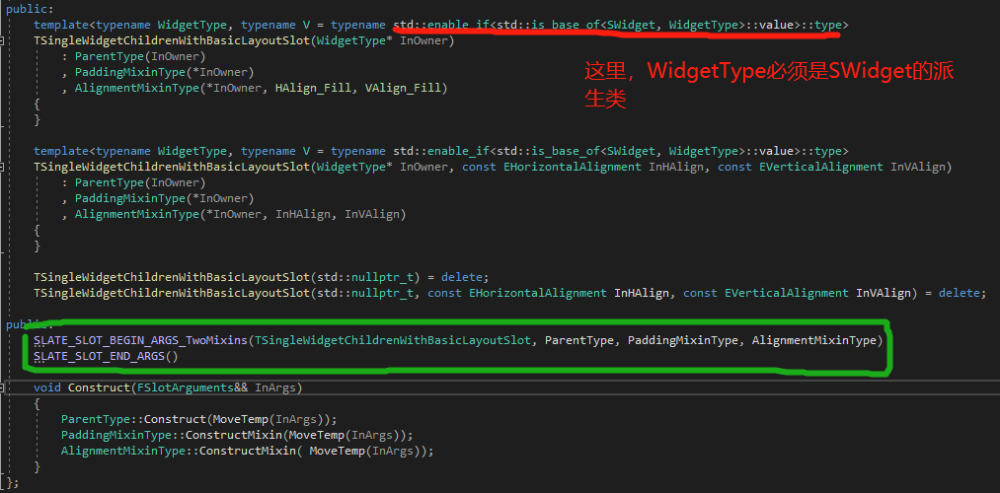

**TSingle Widget Children With Basic Layout Slot**


单个widget children，和基础的布局槽。


```c++
//一个FChildren，只有一个child，并且支持alignment和padding
template<EInvalidationWidgetReason InPaddingInvalidationReason = 
EInvalidateWidgetReason::Layout>

class TSingleWidgetChildrenWithBasicLayoutSlot :
public TSingleWidgetChildrenWithSlot<TSingleWidgetChildrenWithBasicLayoutSlot
<InPaddingInvalidationReason>>,
public TPaddingSingleWidgetSlotMixin<TSingleWidgetChildrenWithBasicLayoutSlot
<InPaddingInvalidationRease>, InPaddingInvalidationReason>,
public TAlignmentSingleWidgetSlotMixin<TSingleWidgetChildrenWithBasicLayoutSlot
<InPaddingInvalidationRease>>
{
private:
    using ParentType = TSingleWidgetChildrenWithSlot<TSingleWidgetChildrenWithBasicLayoutSlot<InPaddingInvalidationReason>>;
    
    using PaddingMixinType = TPaddingSingleWidgetSlotMixin<TSingleWidgetChildrenWithBasicLayoutSlot
<InPaddingInvalidationRease>, InPaddingInvalidationReason>;
    
    using AlignmentMixinType = TAlignmentSingleWidgetSlotMixin<TSingleWidgetChildrenWithBasicLayoutSlot
<InPaddingInvalidationRease>>;
}
```


这里涉及到好多模板类，第一个是TSingleWidgetChildrenWithBasicLayoutSlot，继承

**TSingleWidgetChildrenWithSlot，**//单个widget儿子和槽

**TPaddingSingleWidgetSlotMixin，**//padding单个widget槽混合

**TAlignmentSingleWidgetSlotMixin。**//对齐单个widget槽混合




然后是这两个宏，比较关键。


