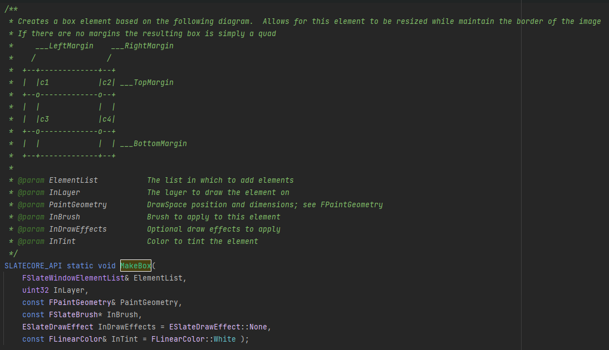

OnPaint函数里面会创建FSlateDrawElement，存放到函数的FSlate**Window**ElementList&里面。


FSlate**Window**ElementList代表意思就是**FSlateDrawElement数组。**


FSlateDrawElementList有大量静态函数，**比如MakeBox**，构造一个FSlateDrawElement放置在FSlate**Window**ElementList里面。




创建一个box元素基于如下的图解。允许在保持图像边界的同时调整此元素的大小，如果这里没有margins，结果的box只是一个简单的一个quad。


```c++
ElementList 去添加元素的list
InLayer 去绘制元素所在的layer
PaintGeometry 绘制空间位置还有维度，查看FPaintGeometry
InBrush 去应用这个元素的画刷
InDrawEffect 可选的绘制效果去应用
InTint 颜色去给元素染色
```


总共18个三角形。


```c++
void FSlateDrawElement::MakeBox(
	FSlateWindowElementList& ElementList,
	uint32 InLayer,
	const FPaintGeometry& PaintGeometry,
	const FSlateBrush* InBrush,
	//const FSlateResourceHandle& InRenderingHandle,
	ESlateDrawEffect& InDrawEffects,
	const FLinearColor& InTint
)
{
    //如果PaintGeometry是默认构造的，那么后续可以延迟提交，否则这个函数等于没有调用
	PaintGeometry.CommitTransformsIfUsingLegacyConstructor();

    //是否剔除
	if (ShouldCull(ElementList, PaintGeometry, InBrush, InTint))
	{
		return;
	}

    //make box internal
	MakeBoxInternal(ElementList, InLayer, PaintGeometry, InBrush, InDrawEffects, InTint);
}
```


或许有很多这样的静态函数，需要复用这个MakeBoxInternal函数。


```c++
//MakeBoxInternal

EElementType ElementType = (InBrush->DrawAs == ESlateBrushDrawType::Border) ?
EElementType::ET_Border : 
(InBrush->DrawAs == ESlateBrushDrawType::RoundedBox) ? EElementType::ET_RoundedBox : EElementType::ET_Box;

//这里决定了元素类型，根据画刷的DrawAs来决定这个元素类型
//如果是Boder，即边界的话，就是ET_Boder
//否则根据是否是RoundedBox，处理成RoundedBox，或者Box

//然后是ElementList调用AddUnitialized函数，去添加一个未经初始化的元素，并且返回

//如果是RoundedBox，则进行一系列额外的处理，否则简单地调用CreatePayload<FSlateBoxPayload>(Element)

//然后Element.Init(ElementList, ElementType, InLayer, PaintGeometry, InDrawEffects);
//把需要的参数给予Element的Init函数，进行初始化
```


